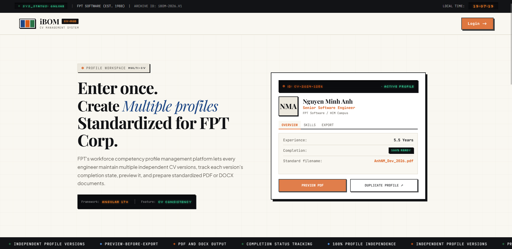

# iBOM UI

Frontend application for the **iBOM CV Management System**.

Manage professional profiles, maintain multiple CV versions, preview CVs, and prepare standardized documents.

<p align="center">
  
</p>

## Overview

**iBOM UI** provides the frontend experience for the iBOM platform.

The system is designed to help users manage professional information and create multiple CV profiles for different roles while keeping profile data organized and consistent.

## Features

Current and planned frontend capabilities include:

* Multiple CV profiles
* Profile completion tracking
* CV preview
* PDF export
* DOCX export
* Profile management
* Authentication
* Responsive web interface

## Tech Stack

* Angular 17
* TypeScript
* SCSS
* Angular Router
* RxJS
* GSAP
* Jasmine / Karma

## Getting Started

### Prerequisites

* Node.js
* npm
* Git

### Installation

```bash
git clone https://github.com/datphamtat2411/iBOM-UI.git
cd iBOM-UI
npm install
```

### Run Development Server

```bash
npm start
```

or:

```bash
npx ng serve
```

Open:

```text
http://localhost:4200
```

## Build

```bash
npm run build
```

## Test

```bash
npm test
```

## Available Scripts

| Command         | Description                            |
| --------------- | -------------------------------------- |
| `npm start`     | Start development server               |
| `npm run build` | Build the application                  |
| `npm run watch` | Build continuously in development mode |
| `npm test`      | Run unit tests                         |


