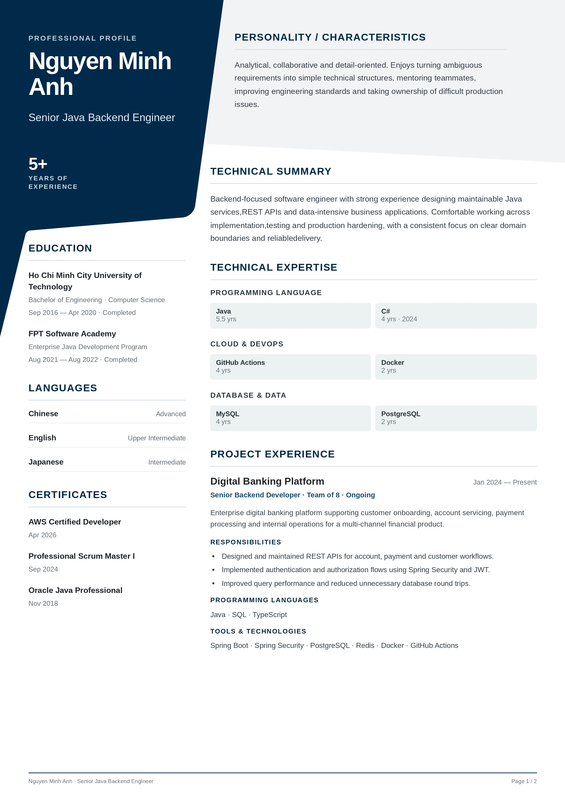
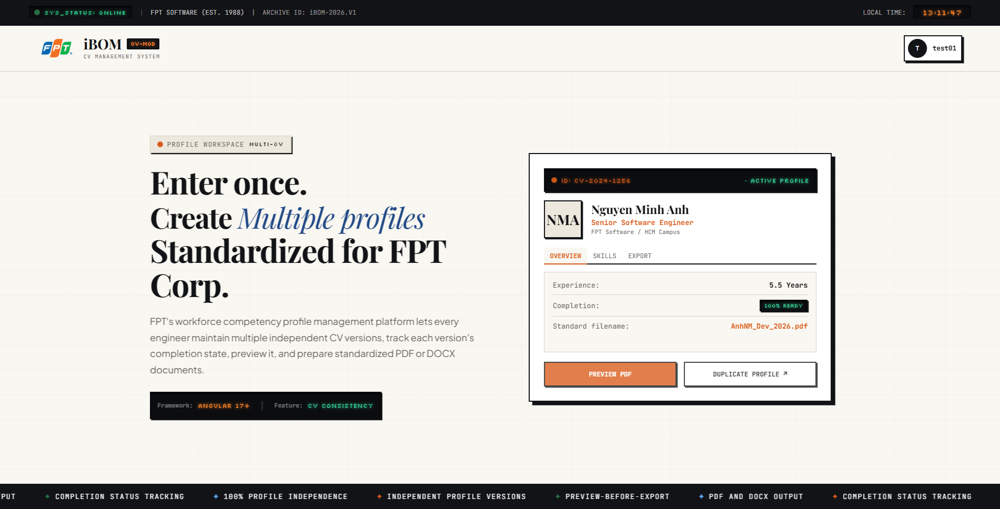
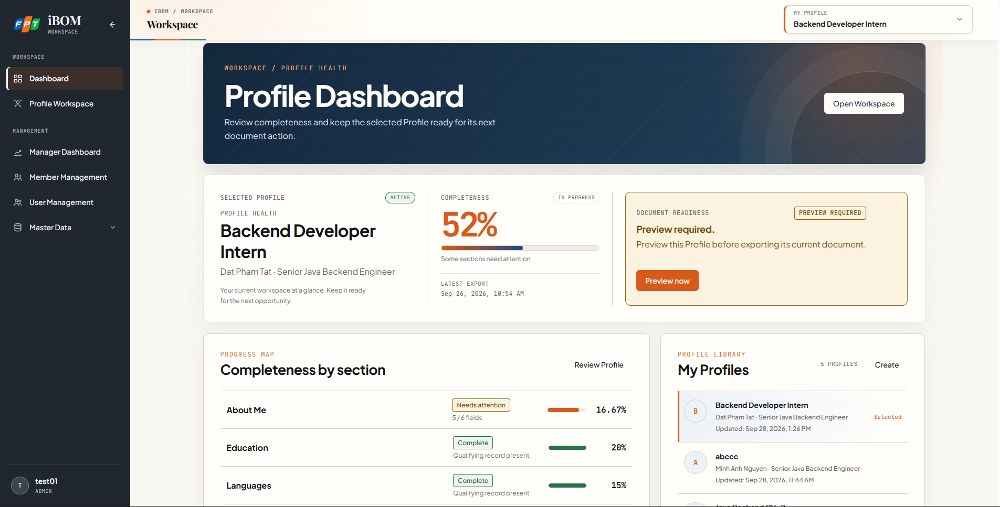

<div align="center">

# iBOM

Internal CV/Profile Management System for maintaining professional profiles,
managing multiple CV versions, and generating standardized CV documents.

</div>

<p align="center">
  
</p>

## Application Preview

### Homepage

<p align="center">
  
</p>

### Member Workspace

<p align="center">
  
</p>

## Core Features

- Authentication and account management
- Multiple independent CV profiles
- About Me, Education, Languages, Certificates, Projects, and Skills
- Profile completeness tracking
- CV preview
- PDF and DOCX export
- Member dashboard
- Manager dashboard
- Member management and search
- Master data management
- User management
- Role-based access

## Getting Started

### Prerequisites

- Node.js
- npm
- Git

### Frontend

```bash
git clone https://github.com/datphamtat2411/iBOM-UI.git
cd iBOM-UI

npm install
npm start
```

The application runs at:

```text
http://localhost:4200
```

### Backend API

iBOM UI integrates with the backend application maintained in:

**[iBOM-API](https://github.com/datphamtat2411/iBOM-API)**

Follow the backend repository instructions to configure and run the API before using frontend features that require server integration.

